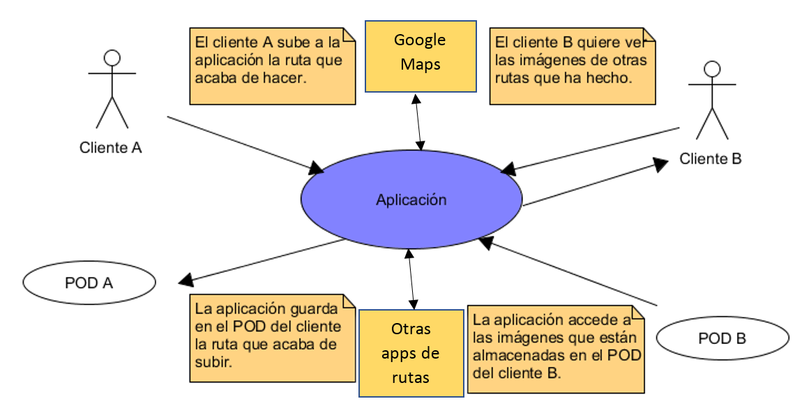

[[section-system-scope-and-context]]
== System Scope and Context
=== Business Context

[role="arc42help"]
****
La aplicación permite a los clientes compartir sus rutas, fotos de ellas y muchas más cosas, de forma descentralizada gracias a los POD, que son almacenes de datos en línea y son personales para cada usuario.

[cols="1,2" options="header"]
|===
| **Participante** | **Contexto**
| _Cliente_ | _Utiliza la aplicación, comparte sus rutas,busca rutas de otros usuarios, etc._
| _POD_ | _Son los almacenes donde se encuentran todos los datos del cliente que se necesitan para utilizar la aplicación, es decir, en estos almacenes es donde se guardan las rutas, las fotos, los mensajes, etc. La clave de utilizar los POD es que nos permite separar la aplicación de los datos._
| _Aplicación_ | _Cuando un usuario quiera realizar una acción en dicha aplicación, esta accederá a su POD para realizar la operación deseada, como por ejemplo, subir una ruta._
|===

****

=== Technical Context

[role="arc42help"]
****
.Contents
Technical interfaces (channels and transmission media) linking your system to its environment. In addition a mapping of domain specific input/output to the channels, i.e. an explanation with I/O uses which channel.

.Motivation
Many stakeholders make architectural decision based on the technical interfaces between the system and its context. Especially infrastructure or hardware designers decide these technical interfaces.

.Form
E.g. UML deployment diagram describing channels to neighboring systems,
together with a mapping table showing the relationships between channels and input/output.

****

**<Diagram or Table>**

**<optionally: Explanation of technical interfaces>**

**<Mapping Input/Output to Channels>**
