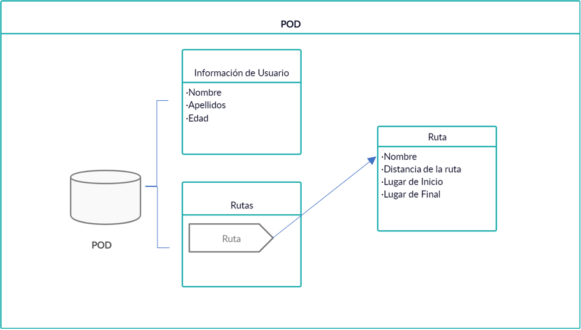

[[section-building-block-view]]

== Building Block View

=== Whitebox Overall System

Viade es una aplicación de gestión de rutas descentralizada creada con SOLID. SOLID es un proyecto liderado por Tim Berners-Lee cuyo objetivo es cambiar la forma en que funcionan las aplicaciones web hoy en día. 
Para hacer esto posible, como primera parte del proyecto, SOLID ha creado SOLID Pods, una especie de llaveros usb online.

== Bloques de construcción contenidos
En la siguiente imagen mostramos las relacciones entre los elementos de alto nivel.
Podemos distinguir los PODS de los usuarios, almacenes descentralizados donde los usuarios almacenarán sus datos, rutas etc. Por otro lado tenemos la aplicación Viade, que utilizando solid se intercomunica con los Pods, y con
la api de Google Maps.

=== Nivel 1

image:Esquema1.png["General View"]

.Descripciones del nivel
|===
|Nombre |Responsabilidad

|Usuario
|Utilizarán la aplicación para subir sus rutas y compartirlas con otros usuarios

|Pod 
|Funcionarán como intermediarios entre las diferentes aplicaciones de los usuarios

|Viade App
|La aplicación proporcionará toda la funcionalidad a los usuarios y se comunicará con los Pods.
|===

=== Pod

En esta caja se resumen las operaciones de lectura y escritura que se realizan con los pods, que es donde se almacen las distintas rutas. En la interfaz ruta se guardan los datos de una ruta como su nombre, lugar de salida, 
lugar de final, distancia, etc.

