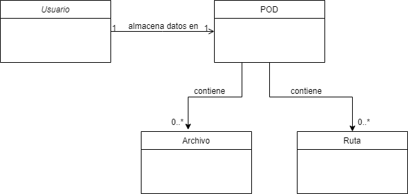

[[section-concepts]]
== Cross-cutting Concepts

=== Conceptos del Dominio

[options="header"]
|===
| Entidad         | Descripción
| Usuario     | Stakeholder que comparte rutas
| Ruta        | Es compartida por el usuario con otros usuarios
| Archivo     | Archivos como fotos o vídeos que puede compartir el usuario                    con otros usuarios
| POD         | Dónde el usuario puede almacenar las rutas
|===

=== Arquitectura y diseño

==== React
Usamos el diseño de arquitectura en React. Se compone de módulos y componentes que siguen el MVC (Modelo Vista Controlador).

==== Arc42
Para realizar esta documentación usaremos arc42, que nos proporciona plantillas para la documentación y comunicación de software y arquitecturas de sistemas.

=== Experiencia de Usuario

==== Diseño de la interfaz de usuario
La interfaz de usuario será desarrollada con React.

==== Internacionalización
La aplicación estará disponible en castellano_

=== Under-the-hood

En cuanto a persistencia, la aplicación usará el propio POD del usuario como base de datos del servidor SOLID donde esté alojada la cuenta. El usuario podrá almacenar en el POD todas las rutas que comparta. El sistema se basará en una arquitectura descentralizada en la que los datos estarán separados de la aplicación.

==== Manejo de expcepciones y errores 
Se completará más adelante.

=== Seguridad

Todas las rutas y demás archivos que el usuario comparta, así como sus datos, estarán almacenados en el POD por lo que dicho usuario es el único que tiene acceso. El sistema se basará en una arquitectura descentralizada, por tanto, al estar los datos separados de la aplicación, esta será más segura.

=== Conceptos de desarrollo

Se completará más adelante.
